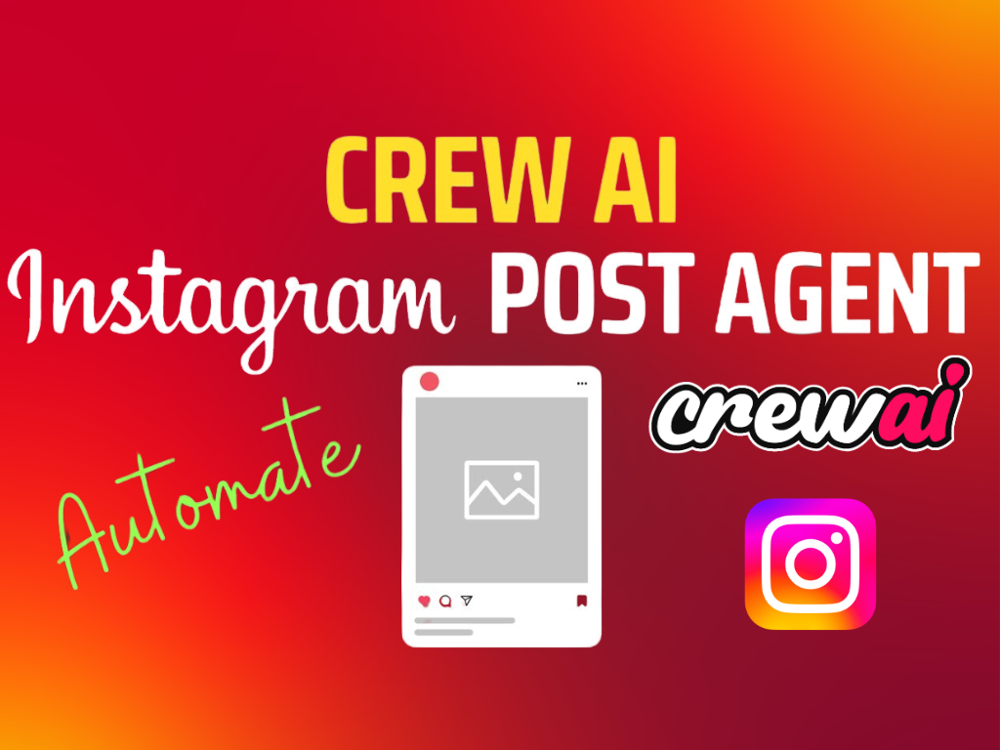

# AI Team for Instagram Content

## Overview
This project demonstrates the use of the CrewAI framework to automate the creation of Instagram content. CrewAI coordinates autonomous AI agents, allowing them to work together and efficiently handle complex tasks.

- [CrewAI Framework](#crewai-framework)
- [Executing the Script](#executing-the-script)
- [In-Depth Explanation](#in-depth-explanation)
- [Utilizing Local Models with Ollama](#utilizing-local-models-with-ollama)
- [License](#license)

## CrewAI Framework
CrewAI is crafted to enable the collaboration of AI agents in role-playing scenarios. In this instance, these agents collaborate to provide a comprehensive stock analysis and investment advice.

## Executing the Script
This example defaults to using llama 3.1 via Ollama, so you should download [Ollama](ollama.ai) and [llama 3.1](https://ollama.com/library/llama3.1).

You can switch the model by modifying the `MODEL` environment variable in the `.env` file.

- **Set Up Environment**: Duplicate `.env.example` and configure the environment variables for [Browseless](https://www.browserless.io/) and [Serper](https://serper.dev/).
- **Install Required Packages**: Execute `poetry install --no-root`.
- **Run the Script**: Execute `python main.py` and provide your idea.

## In-Depth Explanation
- **Script Execution**: Run `python main.py` and provide your idea when prompted. The script will utilize the CrewAI framework to process the idea and generate a landing page.
- **Core Components**:
  - `./main.py`: Primary script file.
  - `./tasks.py`: File containing task prompts.
  - `./agents.py`: File for agent creation.
  - `./tools/`: Directory with tool classes used by the agents.

## Utilizing Local Models with Ollama
This example operates entirely with local models. The CrewAI framework supports integration with both proprietary and local models, using tools like Ollama for enhanced flexibility and customization. This allows you to use your own models, which can be particularly beneficial for specialized tasks or data privacy concerns.

### Configuring Ollama
- **Install Ollama**: Ensure Ollama is installed in your environment. Follow Ollama's installation guide for detailed instructions.
- **Set Up Ollama**: Configure Ollama to work with your local model. You may need to [adjust the model using a Modelfile](https://github.com/jmorganca/ollama/blob/main/docs/modelfile.md); experimenting with `top_p` and `temperature` is recommended.

## License
This project is distributed under the MIT License.
